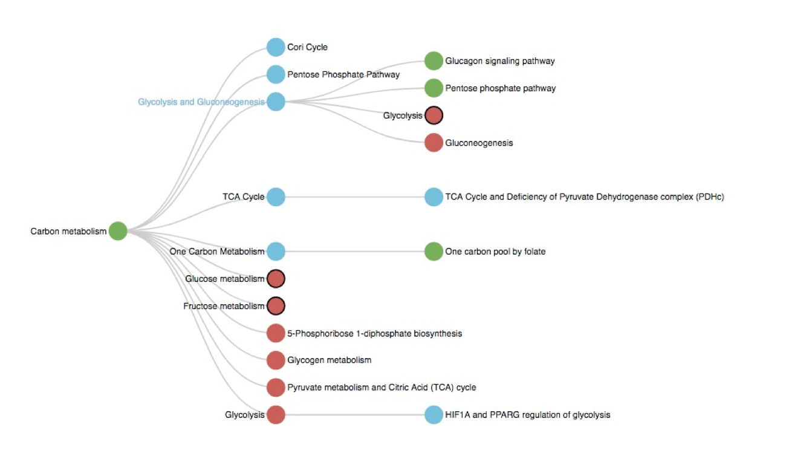

KGE Models for ComPath
======================
This directory contains KGE models trained on ComPath [1]_. The ComPath dataset contains inter- and intra-database pathway mappings that represent equivalent and hierarchically related pathways. The resources included in ComPath are the Kyoto Encyclopedia of Genes and Genomes (KEGG, [2]_), Reactome [3]_, and WikiPathways [4]_. 

To map equivalences and hierarchies of biological pathways, the *equivalentTo* and *isPartOf* relationship were introduced.
These models were generated with the BioKEEN [5]_ extensions to PyKEEN.

Following figure shows hierarchies between pathways:

References
==========
.. [1] Domingo-Fernández, Daniel, *et al.* (2018) `ComPath: An ecosystem for exploring, analyzing, and curating mappings ´
       across pathway databases <https://doi.org/10.1038/s41540-018-0078-8>`_. NPJ systems biology and applications 4.43 .
.. [2] Kanehisa, Furumichi, M., Tanabe, M., Sato, Y., and Morishima, K. (2017) `KEGG: new perspectives on genomes, pathways, 
       diseases and drugs <https://doi.org/10.1093/nar/gkw1092>`_. Nucleic Acids Res. 45, D353-D361.
.. [3] Antonio Fabregat, Steven Jupe, Lisa Matthews, Konstantinos Sidiropoulos, Marc Gillespie, Phani Garapati, Robin Haw,
       Bijay Jassal, Florian Korninger, Bruce May, Marija Milacic, Corina Duenas Roca, Karen Rothfels, Cristoffer Sevilla, 
       Veronica Shamovsky, Solomon Shorser, Thawfeek Varusai, Guilherme Viteri, Joel Weiser, Guanming Wu, Lincoln Stein, 
       Henning Hermjakob, Peter D’Eustachio, `The Reactome Pathway Knowledgebase <https://doi.org/10.1093/nar/gkx1132>`_,
       Nucleic Acids Research, Volume 46,  Issue D1, 4 January 2018, Pages D649–D655, 
.. [4] Slenter DN, Kutmon M, Hanspers K, Riutta A, Windsor J, Nunes N, Mélius J, Cirillo E, Coort SL, Digles D, Ehrhart F,
       Giesbertz P, Kalafati M, Martens M, Miller R, Nishida K, Rieswijk L, Waagmeester A, Eijssen LMT, Evelo CT, Pico AR, 
       Willighagen EL. (2017) `WikiPathways: a multifaceted pathway database bridging metabolomics to other omics research
       <https://doi.org/10.1093/nar/gkx1064>`_. Nucleic Acids Research.
.. [5] Mehdi Ali, Charles Tapley Hoyt, Daniel Domingo-Fernández, Jens Lehmann, & Hajira Jabeen(2019) `BioKEEN: a library for 
       learning and evaluating biological knowledge graph embeddings <https://doi.org/10.1093/bioinformatics/btz117>`_,    
       *Bioinformatics*, btz117.
