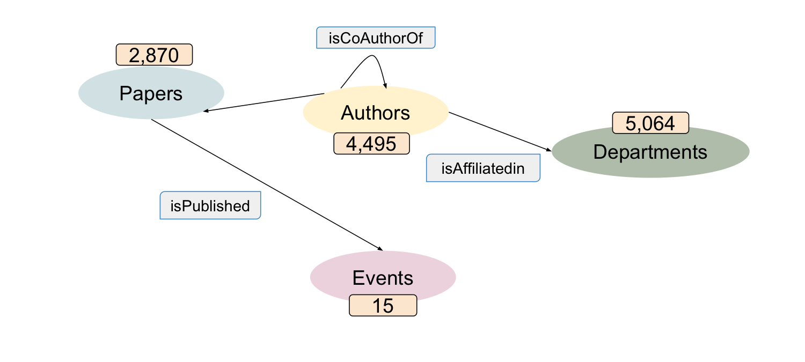

KGE Models for SG4MR
====================

This directory contains KGE models trained on SG4MR [1], a KG for scholarly data containing for entity types:

* *Author*
* *Paper*
* *Department*
* *Event*

and four relationship types:

* *isAuthorOf*: Denotes the relationship between an author and its papers
* *isCoAuthorOf*: Denotes that two authors have at least one joint paper
* *isAffiliatedIn*: Denotes the department to which an author is affliated
* *isPublished*: Denotes the event in which a paper is published

Overall, SG4MR contains 45952 triples (39952 training triples and 6000 test
triples), 2870 paper entities, 4495 author entities, 5064 department entities, and
15 event entities.

References
==========
[1]: Henk, Veronika, et al. "Metaresearch Recommendations using Knowledge Graph Embeddings." (2019).

